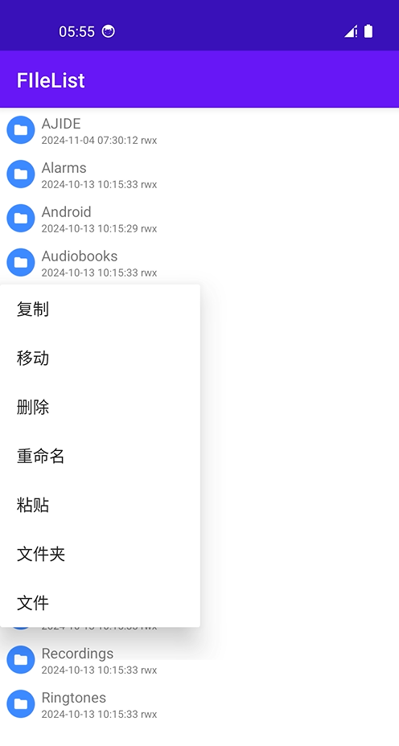

# Android File List
a simple filelist based RecyclerView  
[Maven Central](https://repo.maven.apache.org/maven2/io/github/starrayjan/filelist/)  

sample image

### Getting Started
#### in `build.gradle`
```groovy
implementation("io.github.starrayjan:filelist:+")
```
#### in `settings.gradle`
```groovy
dependencyResolutionManagement {
    repositories {
        mavenCentral()
    }
}
```
### Usage
#### with xml
```xml
<starray.android.filelist.FileListView
    android:layout_width="match_parent"
    android:layout_height="match_parent"
    android:id="@+id/fileListView"
/>
```
```java
import starray.android.filelist.FileListAdapter;
import starray.android.filelist.FileListView;

public class MainActivity extends AppCompatActivity {
    @Override
    protected void onCreate(Bundle savedInstanceState) {
        super.onCreate(savedInstanceState);
        setContentView(R.layout.your_activity_main);
        FileListView fileListView = findViewById(R.id.fileListView);
        fileListView.init(Environment.getExternalStorageDirectory());
    }
}
```
#### or only java
```java
import starray.android.filelist.FileListAdapter;
import starray.android.filelist.FileListView;

public class MainActivity extends AppCompatActivity {
    @Override
    protected void onCreate(Bundle savedInstanceState) {
        super.onCreate(savedInstanceState);
        setContentView(R.layout.your_activity_main);
        fileListView = new FileListView(this);
        fileListView.setLayoutParams(new ViewGroup.LayoutParams(
                ViewGroup.LayoutParams.MATCH_PARENT, 
                ViewGroup.LayoutParams.WRAP_CONTENT));
        fileListView.init(Environment.getExternalStorageDirectory());
    }
}
```
#### event
```java
fileListView.getAdapter().setOnItemClickListener(() -> {
    @Override
    public void onFileItemClick(File file) {
        // do something
    }
});
```